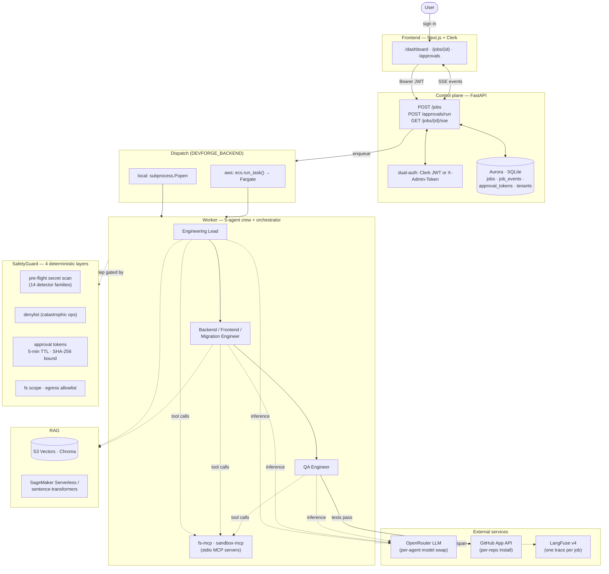

# DevForge

Enterprise multi-agent engineering platform — Andela AI Engineering Bootcamp capstone project. A 5-agent crew (EngineeringLead, BackendEngineer, FrontendEngineer, MigrationEngineer, QAEngineer) plans, implements, tests, and opens a PR for any well-specified ticket against a customer's GitHub repo, inside a sandboxed worktree with strict guardrails.


## Status

Local-first with AWS deploy parity for every layer including the frontend. Ticket submission, one-click approval, live SSE event tail, LangFuse trace deep-link, multi-tenant scoping by Clerk identity, and S3+CloudFront frontend all shipped.

| Concept | Where |
|---|---|
| **Agentic workflow** | 5 agents in `backend/worker/{lead,backend_engineer,frontend_engineer,migration_engineer,qa_engineer}.py` orchestrated by `backend/worker/orchestrator.py` |
| **Tool use** | `fs-mcp` + `sandbox-mcp` MCPs + `search_codebase` function-tool + `submit_for_review` PR-opener |
| **MCP** | 2 custom stdio MCPs in `backend/mcp/{fs_mcp,sandbox_mcp}/server.py` |
| **Guardrails** | `backend/safety/{denylist,injection_scrub,approval,scope,secret_redact}.py` — 4 layers: pre-flight ticket secret scan → denylist → approval-token → fs/egress scope |
| **Security** | Per-tenant GitHub App installs; sandbox in Fargate egress-allowlisted (AWS) or scope-checked (local); secrets in Secrets Manager (AWS) / env (local); audit log of every tool call; control plane dual-auth (Clerk JWT or admin token) |
| **RAG** | Per-tenant Chroma (local) / S3 Vectors (AWS) over AST-chunked code via `backend/ingest/chunker.py` + `index_tenant_repo.py` |
| **Embeddings** | SageMaker Serverless `all-MiniLM-L6-v2` (AWS) or `sentence-transformers` on CPU (local) — same model, same 384-dim output |
| **Observability** | LangFuse v4 cloud — single trace per job (Lead → Backend → QA spans) deep-linked from `/jobs/[id]` |

## Stack

- **LLM:** OpenRouter (per-agent model swap via `backend/worker/models.yaml`)
- **Agents framework:** OpenAI Agents SDK (`openai-agents`)
- **MCP:** Python `mcp` SDK with `MCPServerStdio`
- **Embeddings:** SageMaker Serverless / sentence-transformers
- **Vector store:** S3 Vectors / Chroma
- **Database:** Aurora Serverless v2 (Data API) / SQLite
- **Secrets:** AWS Secrets Manager / `.env.local` + `secrets/`
- **Static analysis:** Semgrep + detect-secrets (gitleaks-equivalent)
- **Testing:** pytest (backend, 106 unit tests across safety + ingest) + vitest (frontend, 9 unit tests for `lib/api.ts`)
- **Observability:** LangFuse v4 cloud (custom Agents-SDK → LangFuse exporter in `backend/worker/crew.py`)
- **Frontend:** Next.js 16 (Pages Router) + Tailwind v4 + Clerk v6 + `@microsoft/fetch-event-source` for header-authenticated SSE
- **Auth:** Clerk JWT for the dashboard, admin token for CLI tooling, dual-auth on every gated endpoint
- **Infra:** Terraform (6 independent modules) + Docker Desktop

## Architecture

A ticket flows from the browser to a 5-agent crew that plans, implements, tests, and ships a PR — all inside a sandboxed worktree. Local and AWS share the same code; only the dispatch shim and the storage adapters differ.



**Read it as request flow:**
1. User signs into the Next.js dashboard via Clerk; every API call carries a `Bearer` JWT.
2. `POST /jobs` (or `POST /approvals/run`) hits the dual-auth gate, persists a job row, and dispatches a worker — `subprocess.Popen` locally, `ecs.run_task()` on AWS. Same downstream code path either way.
3. The orchestrator runs the 5-agent crew through a single LangFuse trace: Lead plans → Engineers code (writes via fs-mcp, runs tests via sandbox-mcp) → QA tests → opens PR via the GitHub App.
4. Every step is intercepted by the four SafetyGuard layers: ticket secrets reject up front, a denylist refuses catastrophic ops, migrations and dep bumps require an approval token, and fs/egress are scope-checked.
5. The browser tails `/jobs/{id}/sse` for live events; the dashboard polls `/jobs?tenant_id=…` every 3s for job-list updates.

## Layout

```
backend/
  control_plane/   FastAPI on Lambda — tenant/jobs/approvals endpoints, SSE stream
  worker/          Crew + orchestrator. Runs locally as subprocess; on AWS as Fargate task.
    crew.py            — OpenRouter client + LangFuse v4 trace exporter
    schemas.py         — TaskPlan + StepKind enum + EngineerResult + QAResult
    lead.py            — EngineeringLead agent (structured output)
    backend_engineer.py
    frontend_engineer.py
    migration_engineer.py — staging-only DDL author
    models.yaml
    qa_engineer.py
    orchestrator.py    — full crew driver + SSE-style event stream + supersede sweep
    worktree.py        — git worktree management
  ingest/          AST chunker + per-tenant codebase indexer
  mcp/             Custom MCP stdio servers
    fs_mcp/server.py     — read/write/list scoped to worktree
    sandbox_mcp/server.py — run_tests, run_coverage, run_semgrep, run_gitleaks
  safety/          SafetyGuard modules (deterministic, no LLM)
    secret_redact.py     — 14 detector families, used by ticket pre-flight + future log scrub
  cost/            OpenRouter usage tracker + dashboard CLI
  common/          Backend adapter (LocalBackend / AWSBackend) + admin_headers helper
  database/        Migrations + run_migrations.py with PG→SQLite translator
frontend/          Next.js 16 + Clerk + Tailwind v4 dashboard
  pages/
    dashboard.tsx      — tenant + recent jobs (3s poll, status filter, search)
    jobs/[id].tsx      — live SSE event timeline + LangFuse trace deep-link
    approvals.tsx      — pending approvals + Approve & run button
  lib/
    api.ts             — typed fetch wrapper + Clerk JWT attachment
    sse.ts             — fetch-event-source wrapper for header-auth SSE
  components/
    NewTicketModal.tsx, PendingApprovalCard.tsx, EventCard.tsx, StatusBadge.tsx
terraform/
  1_permissions/   Secrets Manager (OpenRouter key, GitHub App PEM) + IAM policy + CMK
  2_sagemaker/     Embedding endpoint
  3_database/      Aurora Serverless v2 with Data API
  4_worker/        ECS Fargate + 443-only egress SG
  5_control_plane/ Control plane Lambda + HTTP API
  6_frontend/      S3 + CloudFront (OAC, SPA fallback) for the static-export Next app
tests/
  conftest.py            — sys.path setup + tmp_db fixture (per-test SQLite + migrations)
  safety/                — test_secret_redact, test_denylist, test_approval (92 tests)
  ingest/                — test_chunker (14 tests)
frontend/lib/api.test.ts — vitest suite for fetch wrappers + URL builders
scripts/
  local_dev.sh           — setup | serve | smoke | onboard
  deploy_aws.sh          — all | <module> | frontend | destroy
  populate_demo_repo.py  — seed the demo FastAPI app via the GitHub App
  index_repo.py          — chunk + embed a tenant's codebase
  search_codebase.py     — semantic search CLI
  run_ticket.py          — full crew E2E with SSE-line stdout (DEVFORGE_JOB_ID-aware)
  mint_approval.py       — issue an approval token for a destructive job
  link_tenant_clerk_identity.py — backfill tenants.clerk_user_id / clerk_org_id
  supersede_stale_approvals.py  — one-shot cleanup of pre-supersede awaiting_approval rows
  redteam.py             — 9 deterministic guardrail tests (pass/fail report)
  verify_mcps.py         — MCP smoke harness
```

## Quickstart (local — Docker + Makefile)

The local stack runs in two containers: control plane (FastAPI on :8001) and frontend (Next.js on :3000). Workers spawn as subprocesses inside the control-plane container per ticket. Source is bind-mounted for hot-reload edit `backend/`, `scripts/`, or `frontend/` and the running stack picks it up.

```bash
cd devforge
cp .env.example .env.local                       # edit: OPENROUTER_API_KEY, GITHUB_APP_*, DEVFORGE_ADMIN_TOKEN, CLERK_JWKS_URL
cp frontend/.env.example frontend/.env.local     # edit: NEXT_PUBLIC_CLERK_PUBLISHABLE_KEY, etc.

make setup        # build images, install deps, run migrations (one-time)
make dev          # control-plane :8001 + frontend :3000

# One-time: link tenant 1 to your Clerk user (so /tenants/me resolves)
make shell
> uv run python -m scripts.link_tenant_clerk_identity 1 --user user_<your-id>
> exit

make seed         # populate + index the demo GitHub repo (one-time)
make ticket       # run the default demo ticket E2E through the crew
make test         # 106 pytest + 9 vitest unit tests, ~3s, $0
make redteam      # 9/9 deterministic guardrails, $0
make cost         # per-job cost dashboard
make logs         # tail both services
make stop         # graceful shutdown
make clean        # wipe volumes + data/
```

`make help` lists every target.

### Unit tests

```bash
make test           # both suites
make test-backend   # uv run pytest -q
make test-frontend  # cd frontend && npm test (vitest)
```

Coverage targets the safety-critical primitives whose regressions cause silent damage:

| Module | Tests | What's covered |
|---|---|---|
| `backend/safety/secret_redact.py` | 43 | 14 detector families × scan + redact + false-positive guards |
| `backend/safety/denylist.py` | 40 | 3-tier classifier (safe/destructive/catastrophic) + plan-step path |
| `backend/safety/approval.py` | 9 | mint/verify round-trip, one-time use, TTL, command-swap, strict job scoping |
| `backend/ingest/chunker.py` | 14 | Python AST + JS heuristic + line-window fallback + repo walk skip rules |
| `frontend/lib/api.ts` | 9 | fetch wrappers, JWT attachment, 422 secret-rejection surfacing, URL builders |

Pytest fixtures (`tests/conftest.py`) provide a per-test SQLite at `tmp_path/devforge.db` with all migrations applied — no test ever touches the dev DB.

> **Non-Docker fallback:** the original `./scripts/local_dev.sh` flow is still supported for power users who want the host's `uv` + `npm` directly. 
> Run `./scripts/local_dev.sh setup && ./scripts/local_dev.sh serve` and start `cd frontend && npm run dev` in another terminal.
> `Makefile` is the documented path going forward; `local_dev.sh` is preserved.

## See also

- **[DEPLOY.md](DEPLOY.md)** — AWS deployment runbook, threat model, and v1 trade-offs.
